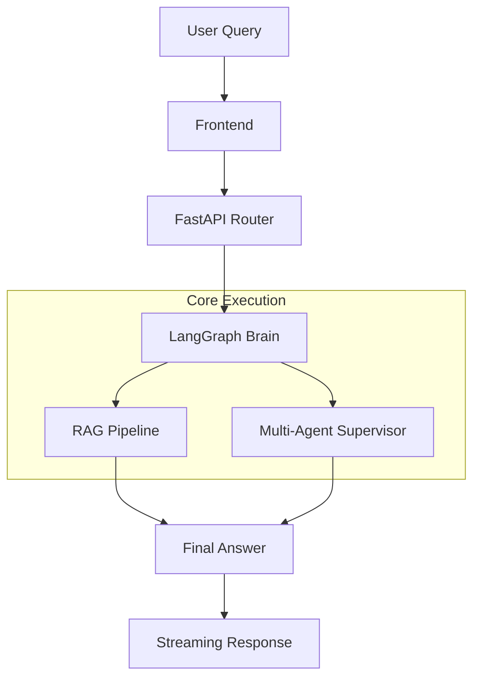

# Technical Architecture & Query Flow

This document serves as the definitive guide to the Enterprise AI Assistant's architecture. It details the end-to-end journey of a user query, identifying every object and interaction in the system.

---

## 1. System Visualization

### Conceptual Architecture

*If the image above does not load, please refer to the Mermaid and ASCII diagrams below.*

### High-Level Path (Mermaid)


### Flow Fallback (ASCII Diagram)
```text
[ USER QUERY ]
      |
      v
+------------------+     +------------------+
|  ChatInput.tsx   | --> |  API Backend     |
|  (Next.js FE)    |     |  (FastAPI)       |
+------------------+     +------------------+
                               |
                               v
+------------------+     +------------------+
| Session Memory   | <---| Semantic Router  |
| (SQLite/SQLAlchemy)|   | (LangGraph Node) |
+------------------+     +------------------+
                               |
            ---------------------------------------
            |                                     |
            v                                     v
+-----------------------+         +-----------------------+
|   RAG PIPELINE        |         |   AGENT SUPERVISOR    |
| (qa_chain.py)         |         | (supervisor.py)       |
+-----------------------+         +-----------------------+
| 1. HyDE Enrichment    |         | 1. Specialist Lookup  |
| 2. Vector Retrieve    |         | 2. Worker Execution   |
| 3. Graph Enrichment   |         | 3. Tool Calling       |
| 4. LLM Synthesis      |         | 4. Generative UI      |
+-----------------------+         +-----------------------+
            |                                     |
            ---------------------------------------
                               |
                               v
+------------------+     +------------------+
| StreamingResponse| --> | MessageBubble.tsx|
| (NDJSON Stream)  |     | (Frontend Render)|
+------------------+     +------------------+
```

---

## 2. End-to-End Object Journey

When a user submits a query, the following objects are triggered in sequence:

### Sequence 1: Input & Authentication
1.  **`ChatInput.tsx`**: The React component captures the user's string and triggers an `axios` or `fetch` POST request.
2.  **`main.py`**: The FastAPI entry point receives the request.
3.  **`HTTPBearer` & `get_current_user`**: Validates the JWT token in the request header via `auth_handler.py`.
4.  **`QueryRequest`**: A Pydantic model that validates the incoming JSON structure.

### Sequence 2: Context Retrieval
5.  **`get_conversation`**: In `sqlite_memory.py`, this object queries the SQLite database for historical messages.
6.  **`summarize_conversation`**: In `context_summarizer.py`, this uses an LLM to condense long histories into a "Memory Summary" object.

### Sequence 3: Orchestration (LangGraph)
7.  **`app_graph`**: The main `StateGraph` object in `router_graph.py` takes control.
8.  **`semantic_router` Node**: Uses a `ChatPromptTemplate` and `OllamaLLM` (Mistral) to classify the query into a `route` string (rag, agent, or greeting).
9.  **`route_condition`**: A conditional edge function that looks at the `RouterState` object and decides which execution node to trigger.

---

### Sequence 4A: The RAG Path (Retrieval)
10. **`execute_rag` Node**: Triggered if the route is 'rag'.
11. **`get_qa_chain`**: Creates the orchestration logic for retrieval inside `qa_chain.py`.
12. **`HyDE` Prompt**: Generates a hypothetical document to enrich the search query.
13. **`ParentDocumentRetriever`**: In `retriever.py`, this object coordinates between the **`Chroma`** (Vector Store) and **`LocalFileStore`** (Docstore) to find relevant text chunks.
14. **`CrossEncoder`**: The reranker object in `reranker.py` scores the results to ensure top-tier relevance.
15. **`retrieve_from_graph`**: In `graph_retriever.py`, this object converts the natural language query into a **Cypher Query** and executes it against the **Neo4j** database.
16. **`OllamaLLM` (Final Generation)**: Combines the vector context and graph context into a final natural language answer.

---

### Sequence 4B: The Agent Path (Execution)
10. **`execute_agent` Node**: Triggered if the route is 'agent'.
11. **`compiled_supervisor`**: A secondary `StateGraph` in `supervisor.py` that manages the multi-agent logic.
12. **`classify_query`**: A supervisor-specific node that picks a specialist agent based on the tools required.
13. **`Worker Agents`**: Created using `create_react_agent`, these objects (e.g., `data_analyzer`, `support_agent`) possess specific **Tool** objects.
14. **`Tools`**: Individual objects like `query_database` or `generate_chart_data` that perform side-effects.
15. **`_extract_ui_from_tool_messages`**: An extractor object that parses tool logs to identify UI components (charts, tables).

---

### Sequence 5: Output Rendering
17. **`StreamingResponse`**: The FastAPI object that maintains an open connection to the client.
18. **`_ndjson_line`**: A formatting utility that packs data into Newline-Delimited JSON frames.
19. **`MessageBubble.tsx`**: The final React component on the frontend that parses the stream.
20. **`ReactMarkdown` & `DynamicRenderer`**: The objects responsible for turning the tokens and tool data into formatted text and interactive UI widgets.

---

## 3. Technology Stack Reference

| Component | Object / Technology | Responsibility |
| :--- | :--- | :--- |
| **Orchestrator** | LangGraph | State management and routing |
| **Logic** | LangChain | Prompting and LCEL chains |
| **LLM** | Mistral (via Ollama) | Intelligence and reasoning |
| **Vector DB** | ChromaDB | Semantic document retrieval |
| **Graph DB** | Neo4j | Relationship and entity retrieval |
| **Memory** | SQLite | Persistent conversation history |
| **Backend** | FastAPI / Uvicorn | API handling and streaming |
| **Frontend** | React / Next.js | User interface and rendering |
